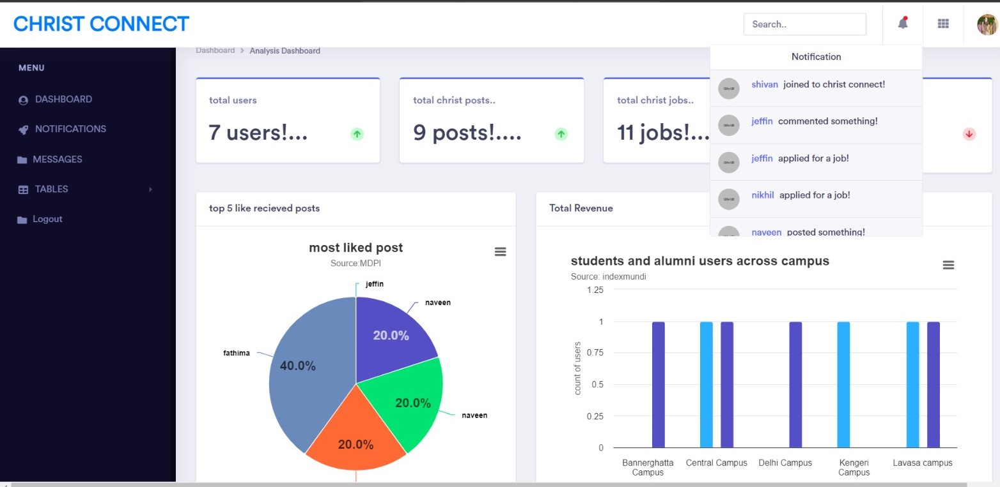
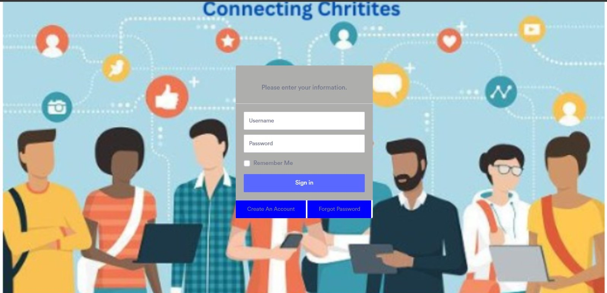
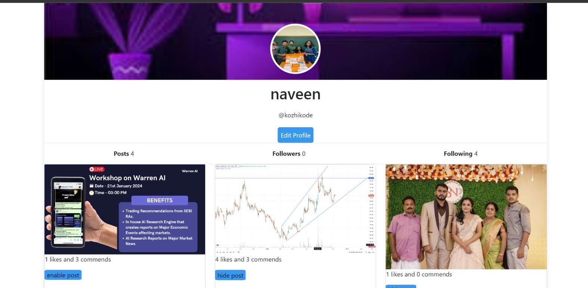
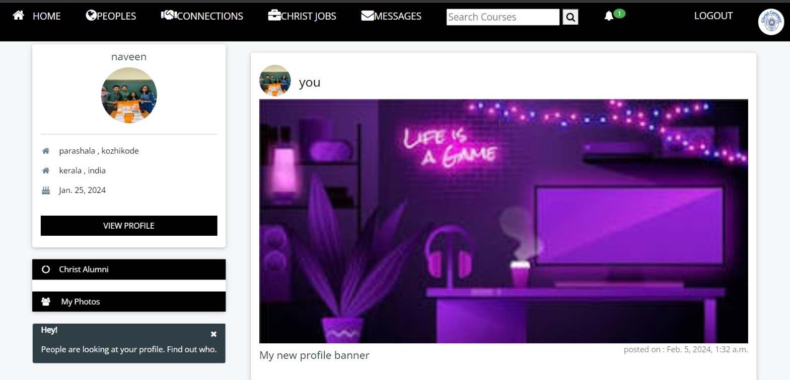
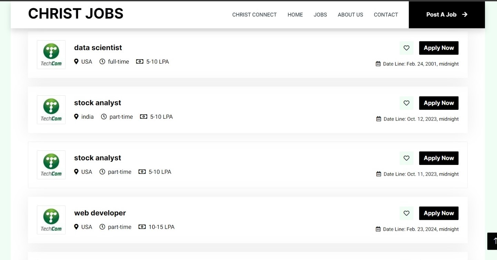
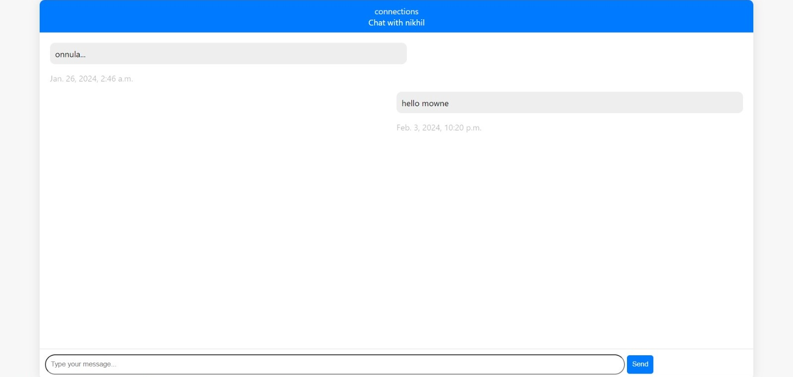

# Django Social Media App

INTRODUCTION

Welcome to the Django Social Media App! This project is designed to create a social media platform for CHRISTIITES of same as well as different campuses with various modules including an admin page, login page, user profiles, a home page, and a job portal.The goal of this project is to provide  django project template that all present CHRISTITES and alumni can use.

## Table of Contents
1. [Project Overview](#project-overview)
2. [Features](#features)
3. [Installation](#installation)
4. [Usage](#usage)
5. [Project Structure](#project-structure)
6. [Dependencies](#dependencies)


## Project Overview

This Django project aims to provide a comprehensive social media platform with the following modules:

1. **Admin Page (Dashboard):** It allows administrators to register user profiles, manage notifications, and handle messages.
 

2. **Login Page:** Provides a secure login page for users to access only to their own account on the social media platform.


3. **User Profile:** Enables users to create and manage their profiles, allowing them to post photos, videos, post their achievements and other content.


4. **Home Page:** Displays posts from other users, providing a centralized feed of shared content to like and comment.


5. **Job Portal:** An exclusive section for alumni to post available job opportunities, fostering career connections within the community of Christites.


6. **Message box:** A message box for the users to interact with each other



## Main Features

- User authentication and authorization.
- Profile creation and management.
- Posting and viewing photos, videos, and other content.
- Centralized home page feed.
- Admin dashboard for user management and notifications.
- Job portal for alumni to post and view job opportunities.

## Installation

 Clone the repository from github and switch to new directory:

```bash
git clone https://github.com/nikhilravindren/CAC_2_CHRIST_CONNECT.git
cd django-CAC_2_CHRIST_CONNECT
```


 Install dependencies:

```bash
pip install -r requirements.txt
```

 Apply database migrations:

```bash
python manage.py migrate
```

## Usage

1. Run the development server:

```bash
python manage.py runserver
```

2. Access the application in your browser at the link provided

3. Explore different modules and features of the social media app.

## Project structure
django-social-media-app/
│
├── media/
│   ├── user/
│   │   └── images/
│   │       └── read/
│   │           ├── dashboard.jpeg
│   │           ├── loginpic.jpeg
│   │           ├── userprofilepic.jpeg
│   │           ├── homepagenewsfeed.jpeg
│   │           ├── christjobspic.jpeg
│   │           └── messagebox.jpeg
│   └── ... (other media files)
│
├── static/
│   └── ... (other static files)
│
├── yourapp/
│   ├── migrations/
│   ├── templates/
│   ├── static/
│   ├── admin.py
│   ├── models.py
│   ├── views.py
│   └── ...
│
├── social_media/
│   ├── settings.py
│   ├── urls.py
│   └── ...
│
├── manage.py
└── README.md


## Dependencies
- Django
- HTML
- CSS
- SCSS
- JavaScript
- Python


